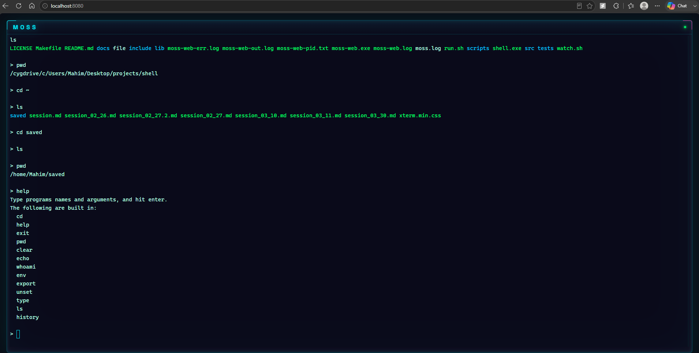

# MOSS — POSIX Shell & Web Terminal

A POSIX compliant Unix shell written in C with 13 builtins, pipeline execution, and a real-time web terminal GUI served from a single zero dependency binary.

---

## Features

### CLI Shell

- **13 builtin commands** — `cd`, `pwd`, `echo`, `ls`, `export`, `env`, `unset`, `whoami`, `clear`, `help`, `type`, `history`, `exit`
- **Pipeline execution** — multi-stage pipes via `fork()` / `execvp()` / `pipe()` / `dup2()`
- **Scrollable history** — circular buffer with configurable capacity, persistent to disk
- **Exponential backoff retry** — resilient `cd` path resolution with up to 3 retries
- **168 cmocka unit tests** — 11 test suites, zero-warning build (`-Wall -Wextra -Wpedantic`)

### Web Terminal GUI

- **Real-time browser terminal** — `xterm.js` real-time rendering
- **PTY-based shell multiplexing** — `forkpty()` spawns the shell inside a pseudo-terminal, I/O streamed over WebSocket
- **TIOCSWINSZ dynamic resize** — browser window resize triggers PTY ioctl, shell redraws instantly
- **Zero-dependency deployment** — 282 KB single binary with all `HTML/CSS/JS` embedded at compile time
- **Badass UI** — neon cyan/magenta frame, scanlines, custom scrollbars, Space Grotesk + Cascadia Code fonts
- **Non-blocking I/O** — `O_NONBLOCK` on PTY master fd, epoll-based event loop via Mongoose

---

## Screenshot



---

## Architecture

```
Browser (xterm.js)
      │ WebSocket
      ▼
moss-web.exe (Mongoose HTTP/WS server)
      │ read/write master_fd
      ▼
PTY (forkpty) ─── shell.exe (MOSS shell)
```

- `shell.exe` — the CLI shell binary (POSIX, ~136 KB)
- `moss-web.exe` — the web server binary (Mongoose + embedded frontend, ~282 KB)
- `scripts/embed.pl` — build tool that bakes frontend files into C byte arrays
- `lib/mongoose/` — Cesanta Mongoose v7.22 (single-file HTTP/WebSocket library)

---

## Quick Start

```bash
git clone https://github.com/MM120-i/MOSS-Shell.git
cd MOSS-Shell
```

### CLI Shell

```bash
make
./shell
```

### Web Terminal

```bash
make
make web
./run.sh web
```

Then open `http://localhost:8080` in your browser. Set a custom port with `MOSS_PORT=9090 ./moss-web.exe`.

---

## Tech Stack

| Category | Technology |
|---|---|
| Language | C (C17, POSIX) |
| Compiler | GCC |
| Build | GNU Make |
| Testing | cmocka (168 tests, 11 suites) |
| CI | GitHub Actions (Ubuntu) |
| Web Server | Mongoose (embedded, single-file) |
| Terminal | xterm.js + xterm-addon-fit |
| Platforms | Linux, macOS, Cygwin |

---

## Builtin Commands

| Command | Description |
|---|---|
| `cd [dir]` | Change directory (`~`, `-`, relative paths, 3-retry backoff) |
| `pwd` | Print working directory |
| `echo [args...]` | Print arguments to stdout |
| `ls [-la] [path]` | List directory (custom implementation, color output) |
| `export NAME=VAL` | Set environment variable |
| `env` | Print all environment variables |
| `unset NAME` | Remove environment variable |
| `whoami` | Print current user |
| `clear` | Clear terminal (ANSI escape) |
| `help` | List all builtins |
| `type [cmd]` | Identify builtin vs. external command |
| `history [-c]` | View or clear command history |
| `exit` | Exit the shell |

External commands are passed through to `execvp()` and resolved from system `PATH`.

---

## License

MIT — see [LICENSE](LICENSE)
